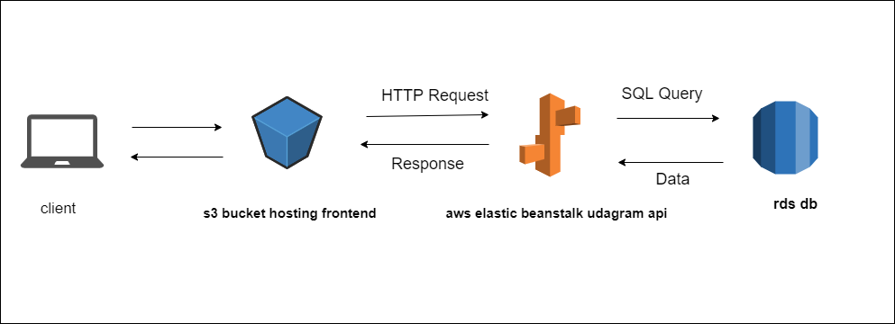

### AWS

* This website is being hosted on AWS.
* Elastic Beanstalk is used to set up the Backend API.
* S3 bucket for hosting frontend.
* RDS database running Postgres.

## high-level overview of the infrastructure

### FrontEnd Enviroment: 

* S3 BucketName: abanob-udagram
    
    S3 URL: `http://abanob-udagram.s3-website.us-east-2.amazonaws.com`

### BackEnd Enviroment: 

## DataBase

# AWS RDS (postgres)

DB ENDPOINT: `database-1.crmvgdfjqunw.us-east-2.rds.amazonaws.com`

* RDS Test connection

## Elastic Beanstalk

* Application Name [EB_APP]: udagram-api
* Enviroment Name [EB_ENV]: udagram-api-dev

    EB URL: `http://udagram-api-dev.eba-e7wei2vd.us-east-2.elasticbeanstalk.com/`

### Deployment Pipeline Enviroment:

* CircleCI
* GitHub Repo: `https://github.com/Abanob-Ashraf/Hosting-a-Full-Stack-Application`
