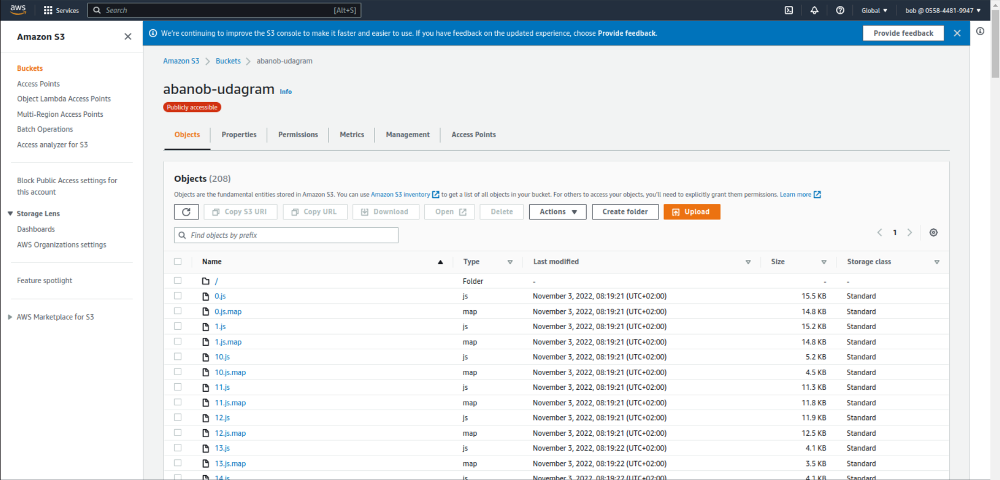
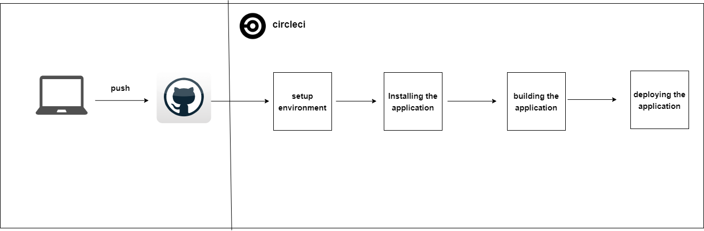
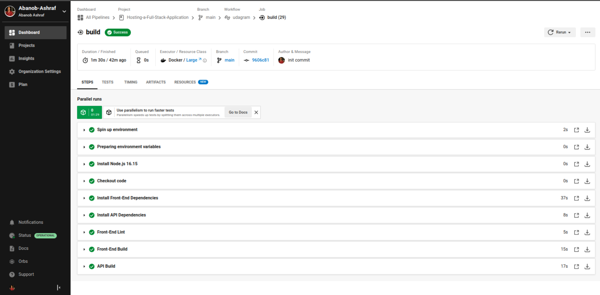
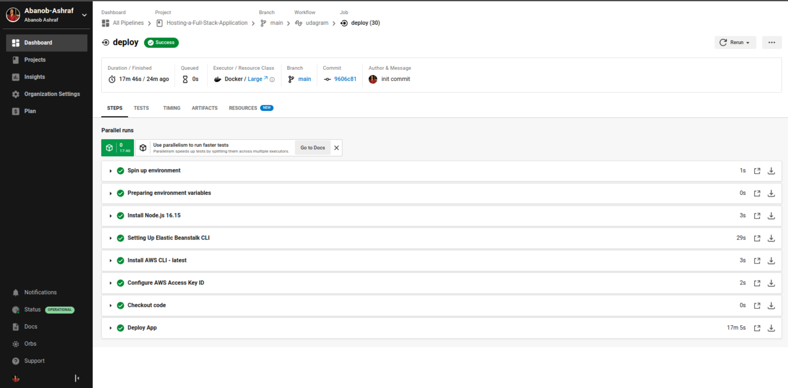
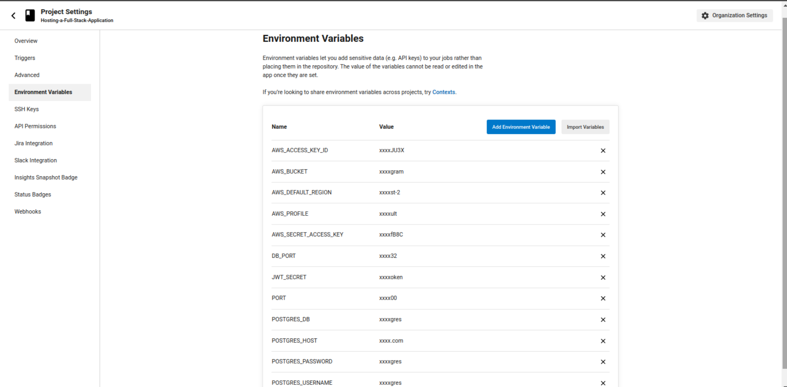

### FrontEnd Deploy Script: 

    aws s3 cp --recursive ./www s3://abanob-udagram/

# S3 Frontend (abanob-udagram)

### BackEnd Deploy Script:
 
    - eb init udagram-api --platform node.js --region us-east-2

    - npm run build

    in ./elasticbeanstalk/config.yml add :
    deploy:
    artifact: www/Archive.zip

    - eb create --sample udagram-api-dev
    - eb use udagram-api-dev
    - eb deploy

# Elastic Beanstalk

## add environment variables: in bin/deploy.sh
    
    eb setenv PORT=$PORT &&
    eb setenv DB_PORT=$DB_PORT &&
    eb setenv POSTGRES_HOST=$POSTGRES_HOST &&
    eb setenv POSTGRES_DB=$POSTGRES_DB &&
    eb setenv POSTGRES_USERNAME=$POSTGRES_USERNAME &&
    eb setenv POSTGRES_PASSWORD=$POSTGRES_PASSWORD &&
    eb setenv AWS_ACCESS_KEY_ID=$AWS_ACCESS_KEY_ID &&
    eb setenv AWS_SECRET_ACCESS_KEY=$AWS_SECRET_ACCESS_KEY &&
    eb setenv AWS_REGION=$AWS_REGION &&
    eb setenv AWS_PROFILE=$AWS_PROFILE &&
    eb setenv AWS_BUCKET=$AWS_BUCKET &&
    eb setenv JWT_SECRET=$JWT_SECRET &&
    eb setenv URL=$URL

# Elastic Beanstalk ENV

# Elastic Beanstalk Health

    
### Pipeline Jobs: 

## 1- Install Dependencies for Front & BackEnd Commands:
    
   - cd udagram-api && npm install
   - cd udagram-frontend && npm install -f

# Pipeline diagram

# Pipline main steps

    
## 2- Build BackEnd & FrontEnd Commands:
    
   - cd udagram-api && npm build
   - cd udagram-frontend && npm build

# CircleCI Build steps

## 3- Deploy FrontEnd & BackEnd Commands:
   
   - cd udagram-api && npm deploy
   - cd udagram-frontend && npm deploy

# CircleCI Deploy step

## CircleCI Environment Variables

